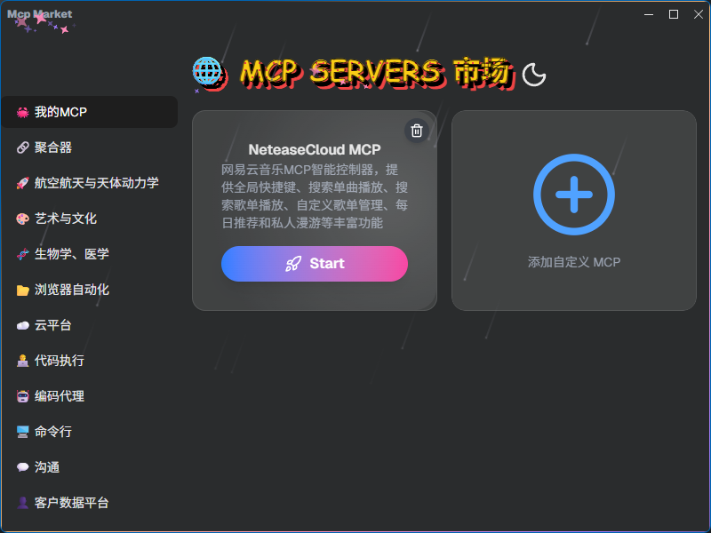
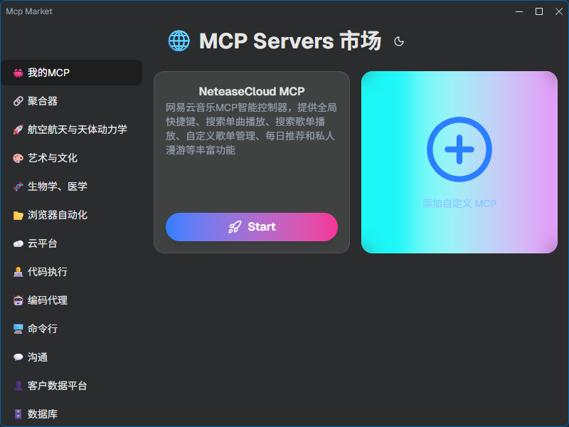
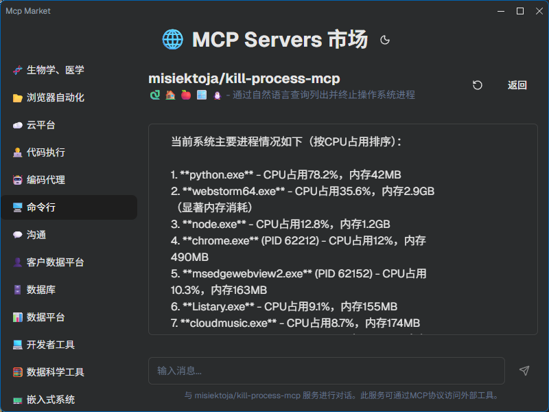

# MCP MARKET

> 🚀 一个精选的优秀模型上下文协议 (MCP) 服务器市场，基于 Electron Forge 与 shadcn-ui 构建, 带有炫酷UI粒子特效



## 📋 项目简介

MCP Market 是一个现代化的桌面应用，用于浏览、管理和配置 MCP (Model Context Protocol)
服务器。该应用提供了一个直观的用户界面，让用户能够轻松地发现、添加和管理自定义 MCP 服务器。

## ✨ 功能特性
- 美观主题
- 粒子特效
- 集成大多数开源MCP 
- 允许自定义MCP JSON配置


## 技术栈
- ⚡ **Electron Forge** - 用于打包、签名和分发 Electron 应用的完整工具
- ⚛️ **React 19** - 最新版本的 React，支持 TypeScript
- 🎨 **shadcn/ui** - 基于 Radix UI 和 Tailwind CSS 构建的可复用组件
- 🔥 **Vite** - 快如闪电的构建工具和开发服务器
- 💅 **Tailwind CSS** - 实用优先的 CSS 框架，集成 shadcn 样式
- 🧪 **Vitest & Playwright** - 单元测试和端到端测试设置
- 🔌 **TypeScript** - 类型安全的开发体验
- 🚀 **现代工具链** - ESLint、Prettier 等代码质量工具
- 📦 **MCP 服务器管理** - 添加、编辑和管理自定义 MCP 服务器配置
- 🔄 **实时配置同步** - 配置文件自动同步到打包后的目录
- 🎯 **多路由支持** - 基于分类的导航系统
 
## 系统要求

- Node.js (v18 或更高版本)
- npm (v8 或更高版本)

## 快速开始

### 1. 克隆仓库

```bash
git clone <repository-url>
cd mcp-market
```

### 2. 安装依赖

```bash
npm install
```

### 3. 启动开发服务器

```bash
npm start
```

这将在开发模式下启动 Electron 应用，并支持热重载功能。

## 可用脚本

| 脚本                     | 描述                    |
|------------------------|-----------------------|
| `npm start`            | 在开发模式下启动 Electron 应用  |
| `npm run package`      | 打包应用以供分发              |
| `npm run make`         | 为所有平台创建可分发的安装程序       |
| `npm run publish`      | 发布应用 (需要配置)           |
| `npm run lint`         | 使用 ESLint 检查代码        |
| `npm run format`       | 使用 Prettier 检查代码格式    |
| `npm run format:write` | 使用 Prettier 应用代码格式化   |
| `npm test`             | 使用 Vitest 运行单元测试      |
| `npm run test:watch`   | 在监听模式下运行单元测试          |
| `npm run test:unit`    | `npm test` 的别名        |
| `npm run test:e2e`     | 使用 Playwright 运行端到端测试 |
| `npm run test:all`     | 运行单元测试和端到端测试          |

## 📁 项目结构

```
mcp-market/
├── src/                           # 源文件
│   ├── main.ts                   # 主进程入口点
│   ├── preload.ts                # 预加载脚本
│   ├── renderer.ts               # 渲染进程入口点
│   ├── components/               # React 组件
│   │   ├── routes/               # 路由组件
│   │   │   ├── BusinessRouteComponent.tsx
│   │   │   └── IndexRouteComponent.tsx
│   │   ├── AddCustomMcpButton.tsx # 添加自定义 MCP 按钮
│   │   ├── GlassEffectCard.tsx   # 玻璃效果卡片
│   │   └── ui/                   # shadcn/ui 组件
│   ├── routes/                   # TanStack Router 路由定义
│   ├── helpers/                  # 辅助函数
│   │   ├── ipc/                  # IPC 通信
│   │   │   └── mcp/              # MCP 相关 IPC 处理
│   │   └── window_helpers.ts     # 窗口辅助函数
│   ├── types/                    # TypeScript 类型定义
│   ├── store/                    # 状态管理 (Zustand)
│   ├── styles/                   # 全局样式
│   └── assets/                   # 静态资源
├── public/                        # 公共资源
│   ├── mcp_config.json           # MCP 配置文件
│   └── my_mcp_config.json        # 自定义 MCP 配置文件
├── .vite/build/public/           # 打包后的公共资源
├── images/                        # 项目截图和文档图片
├── forge.config.ts               # Electron Forge 配置
├── vite.main.config.mts          # 主进程 Vite 配置
├── vite.preload.config.mts       # 预加载脚本 Vite 配置
├── vite.renderer.config.mts      # 渲染进程 Vite 配置
├── components.json               # shadcn/ui 配置
├── tsconfig.json                 # TypeScript 配置
├── eslint.config.js              # ESLint 配置
├── prettier.config.js            # Prettier 配置
└── package.json                  # 项目依赖和脚本
```

## 🎯 核心功能

### MCP 服务器管理

应用提供了完整的 MCP 服务器管理功能：

- **浏览 MCP 服务器** - 查看所有可用的 MCP 服务器列表
- **添加自定义 MCP** - 通过 JSON 配置添加自定义 MCP 服务器
- **编辑配置** - 修改现有的 MCP 服务器配置
- **实时同步** - 配置文件自动同步到打包后的目录

### 配置文件管理

应用支持两种配置文件：

1. **mcp_config.json** - 预定义的 MCP 服务器配置
2. **my_mcp_config.json** - 用户自定义的 MCP 服务器配置

配置文件优先级：

1. 用户数据目录中的覆盖文件
2. `.vite/build/public/` 中的打包文件 ⭐
3. `public/` 目录中的源文件

## 🏗️ 生产构建

要创建应用程序的可分发版本：

```bash
npm run make
```

这将为目标平台在 `out/` 目录中创建安装程序。

创建无安装程序的包：

```bash
npm run package
```

## 测试

### 单元测试

使用 Vitest 运行单元测试：

```bash
npm test
# 或
npm run test:unit
```

在监听模式下运行测试：

```bash
npm run test:watch
```

### 端到端测试

使用 Playwright 运行端到端测试：

```bash
npm run test:e2e
```

### 运行所有测试

运行单元测试和端到端测试：

```bash
npm run test:all
```

## 自定义

### 组件库 (shadcn/ui)

此项目使用 shadcn/ui 组件。您可以使用 CLI 添加更多组件：

```bash
npx shadcn-ui@latest add [组件名称]
```

### 样式 (Tailwind CSS)

Tailwind CSS 已配置了 shadcn/ui 特定设置。可以在 `src/styles/global.css` 中添加自定义样式。

### 图标

此项目使用 Lucide React 图标。您可以从 Lucide 库中导入任何图标：

```tsx
import { Search, User, Settings } from 'lucide-react';

// 在组件中使用
<Search />
<User />
<Settings />
```

## 平台支持

该项目配置为制作以下平台的分发包：

- Windows (Squirrel.Windows, ZIP)
- macOS (ZIP)
- Linux (DEB, RPM, ZIP)

详细信息请参见 `forge.config.ts`。

## 🔧 开发指南

### 代码风格

项目使用以下工具确保代码质量：

- **ESLint** - 代码检查
- **Prettier** - 代码格式化
- **TypeScript** - 类型检查

运行代码检查：

```bash
npm run lint
```

格式化代码：

```bash
npm run format:write
```

### 项目架构

#### 主进程 (Main Process)

- 处理应用生命周期
- 管理窗口
- 暴露 IPC 通道用于文件操作

#### 预加载脚本 (Preload)

- 安全地暴露 IPC 通道给渲染进程
- 定义 `window.mcp` API

#### 渲染进程 (Renderer)

- React 应用
- TanStack Router 路由管理
- Zustand 状态管理

### 添加新的 MCP 服务器

1. 编辑 `public/mcp_config.json` 或 `public/my_mcp_config.json`
2. 添加新的服务器配置：

```json
{
  "mcpServers": {
    "my-server": {
      "name": "My Server",
      "command": "node server.js",
      "args": [
        "--port",
        "8080"
      ],
      "env": {
        "DEBUG": "true"
      },
      "desc": "My custom MCP server"
    }
  }
}
```

3. 应用会自动加载新配置

## 📸 应用截图





## 📝 许可证

本项目采用 MIT 许可证 - 详见 [LICENSE](LICENSE) 文件。

## 🙏 致谢

- [Electron](https://www.electronjs.org/) - 使用 JavaScript、HTML 和 CSS 构建跨平台桌面应用
- [shadcn/ui](https://ui.shadcn.com/) - 使用 Radix UI 和 Tailwind CSS 构建的可复用组件
- [Vite](https://vitejs.dev/) - 下一代前端工具
- [Tailwind CSS](https://tailwindcss.com/) - 快速构建现代网站
- [React](https://reactjs.org/) - 用于构建用户界面的 JavaScript 库
- [TanStack Router](https://tanstack.com/router) - 现代化的 React 路由库
- [Zustand](https://github.com/pmndrs/zustand) - 轻量级状态管理库

## 👨‍💻 作者

**SuperWindCloud**

- Email: ss1178933440@gmail.com
- GitHub: [Super1WindCloud](https://github.com/Super1WindCloud)

## 🤝 贡献

欢迎提交 Issue 和 Pull Request！

## 📞 联系方式

如有问题或建议，请通过以下方式联系：

- 提交 GitHub Issue
- 发送邮件至 ss1178933440@gmail.com